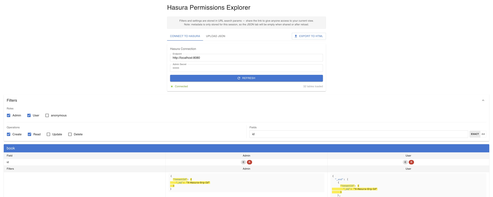

# Hasura Permissions Explorer | **[Try it now](https://jefoce.github.io/hasura-permissions-explorer/)**

[](https://opensource.org/licenses/MIT)
[](https://reactjs.org/)
[](https://www.typescriptlang.org/)



Visualize and explore Hasura GraphQL permissions with powerful filtering.

> Based on the concept of [SocialGouv/hasura-permissions-viewer](https://github.com/SocialGouv/hasura-permissions-viewer)

## Features

- **Connect to Hasura** — Fetch metadata directly via GraphQL endpoint
- **Upload JSON** — Import exported metadata files
- **Smart Filters** — Filter by roles, operations (CRUD), and field search
- **Compare Rules** — Click filter values to highlight matching rules across the table
- **Export** — Generate standalone HTML files with selected data

## Quick Start

```bash
npm install
npm run dev
```
